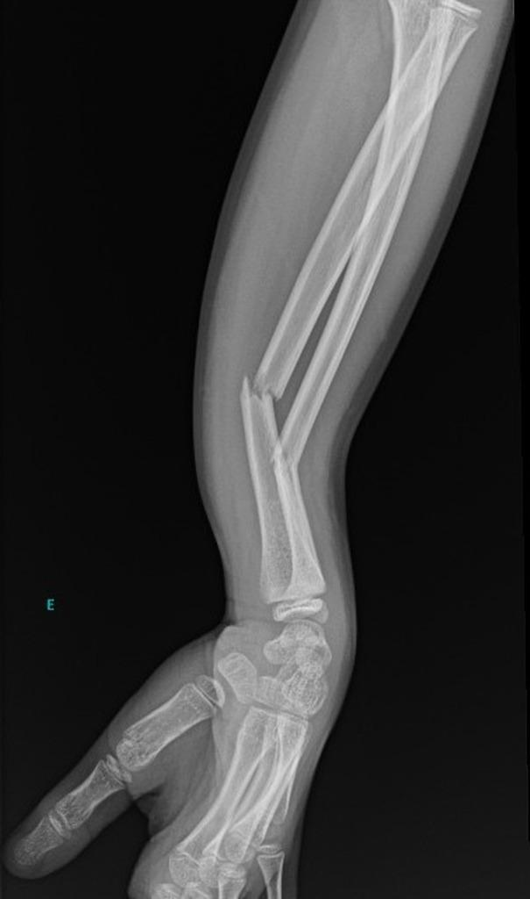
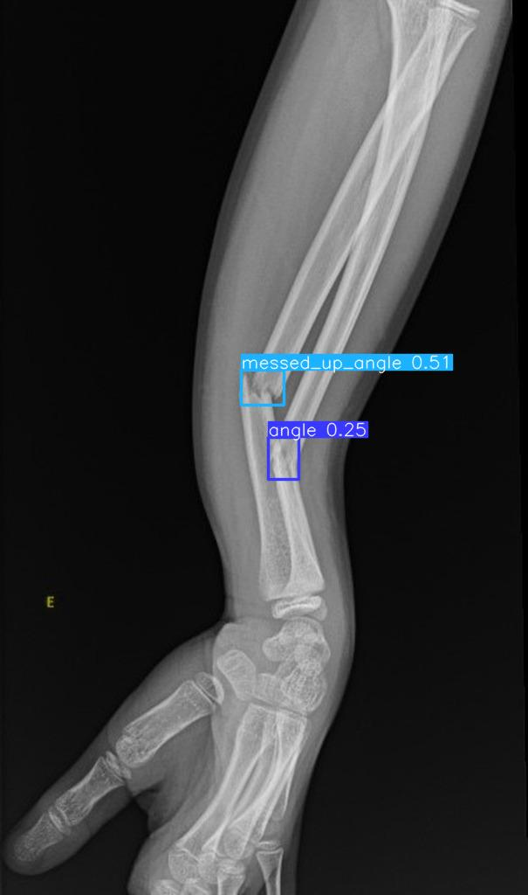

# Bone Fraction Detection with YOLO8

using ultralytics to train yolo on bone fraction object detection ,  
the dataset are from robotflow : [here](https://universe.roboflow.com/roboflow-100/bone-fracture-7fylg/dataset/2)

there are 4 classes : 
1. Angle
2. Fracture
3. Line 
4. Messed up angle

Input             |  Output
:-------------------------:|:-------------------------:
  |  
